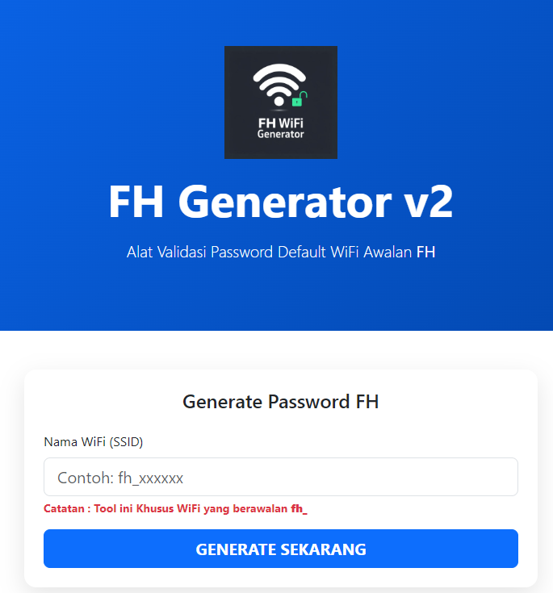

# FH Generator

FH Generator adalah tool berbasis web untuk membantu menghasilkan password default WiFi FiberHome (FH) berdasarkan SSID jaringan. Tool ini dirancang khusus untuk mengenali pola konfigurasi bawaan router FiberHome yang masih menggunakan pengaturan default pabrik.

🌐 Akses Tool:  
👉 http://fhgenerator.somee.com

---

# Fitur Utama

- Generate password default WiFi FiberHome
- Proses cepat dan otomatis
- Tampilan sederhana dan mudah digunakan
- Gratis digunakan
- Mendukung berbagai SSID awalan `fh`
- Tidak memerlukan instalasi aplikasi tambahan

---

# Cara Menggunakan FH WiFi Generator

## 1. Masukkan SSID WiFi

Masukkan nama jaringan WiFi FiberHome pada kolom **SSID Jaringan**.

Contoh SSID:
- `fh`
- `FH`
- `FH-XXXX`
- `fh_indihome`

Pastikan jaringan yang digunakan memang berasal dari router FiberHome.

---

## 2. Generate Password WiFi

Klik tombol **Generate Pass Key** untuk memulai proses generate password default.

Sistem akan secara otomatis menghasilkan password berdasarkan pola konfigurasi bawaan router FiberHome.

---

## 3. Salin Password

Setelah password muncul pada kolom **Password WiFi**, klik ikon salin untuk menyalin password ke clipboard perangkat Anda.

---

## 4. Hubungkan ke WiFi

Buka pengaturan WiFi perangkat Anda, lalu tempelkan password yang sudah disalin sebelumnya.

---

## 5. Selesai

Jika router masih menggunakan password bawaan pabrik, perangkat Anda akan berhasil terhubung ke jaringan WiFi tersebut.

---

# Apa Itu FH WiFi?

FH WiFi merupakan jaringan nirkabel yang berasal dari perangkat router FiberHome. Nama jaringan biasanya menggunakan awalan seperti:

- `fh`
- `FH`
- `FH-XXXX`

SSID tersebut merupakan identitas bawaan router FiberHome yang sering ditemukan pada modem atau router internet rumahan.

---

# Cara Mengetahui Password Default WiFi FiberHome

Berikut langkah umum untuk mengetahui password default WiFi FH:

1. Pastikan SSID diawali dengan `fh`
2. Masukkan nama jaringan pada kolom SSID
3. Klik tombol **Generate Pass Key**
4. Salin password yang muncul
5. Tempelkan pada pengaturan WiFi perangkat Anda

---

# Apakah FH WiFi Generator Aman?

Ya. FH WiFi Generator tidak melakukan:
- Peretasan jaringan
- Brute force
- Bypass keamanan
- Eksploitasi sistem

Tool ini hanya bekerja menggunakan pola konfigurasi default bawaan perangkat FiberHome yang belum pernah diubah oleh pemilik jaringan.

Semua proses bersifat edukatif dan berbasis konfigurasi standar pabrik.

---

# Perbedaan WiFi, WLAN, dan SSID

## WiFi
Teknologi jaringan nirkabel yang digunakan untuk menghubungkan perangkat ke internet.

## WLAN
Singkatan dari Wireless Local Area Network, yaitu jaringan lokal tanpa kabel.

## SSID
Nama jaringan WiFi yang muncul pada daftar jaringan di perangkat Anda.

---

# FAQ (Pertanyaan Umum)

## Apakah FH WiFi Generator bisa digunakan untuk semua WiFi?

Tidak. Tool ini hanya dapat bekerja pada jaringan FiberHome yang masih menggunakan password default bawaan.

---

## Kenapa password hasil generate tidak bisa digunakan?

Kemungkinan password router sudah pernah diubah oleh pemilik jaringan.

---

## Apakah tool ini legal?

Tool ini dibuat untuk tujuan edukasi dan pengenalan konfigurasi default perangkat jaringan. Penggunaan tetap menjadi tanggung jawab masing-masing pengguna.

---

## Apakah FH WiFi Generator gratis?

Ya. Tool ini dapat digunakan secara gratis.

---

# Disclaimer

Tool ini dibuat hanya untuk kebutuhan edukasi, pembelajaran jaringan, dan pengujian konfigurasi default perangkat FiberHome.

Pengembang tidak bertanggung jawab atas penyalahgunaan tool untuk aktivitas yang melanggar hukum atau mengakses jaringan tanpa izin pemilik.

---

# Website Resmi

🌐 http://fhgenerator.somee.com

---

# Keywords

FH WiFi Generator, Password WiFi FH, Generate Password FiberHome, Default Password FiberHome, FH Password Generator, WiFi FiberHome Default Password, Generate Pass Key FH, Router FiberHome, SSID FH, Password WiFi FH Gratis, FH Generator v2, Fiberhome, poetralesana, poetralesanahand
